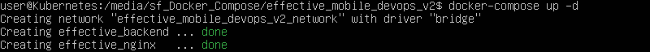
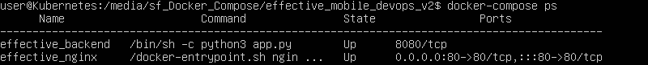
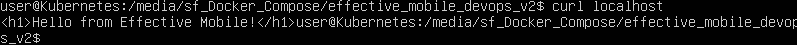
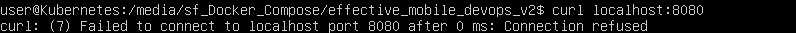

# Effective Mobile DevOps by Shalomeenko Ivan

## Как запустить проект

- Cкопируйте содержимое следующего репозитория любым способом:
https://github.com/shalomeenkoivan-del/effective_mobile_devops_v2

- Перейдите в папку проекта:
cd effective_mobile_devops_v2

- Создайте файл .env из шаблона .env.example:
mv .env.example .env

- Запустите наш "министек" в фоне:
docker-compose -d up

## Как проверить результат

- Проверьте, что контейнеры запустились успешно и работают:
docker-compose ps

- Проверьте доступность через Nginx (ожидаемый вывод - "Hello from Effective Mobile!"):
curl localhost 

- Убедитесь, что бэкэнд скрыт, т.е. не доступен напрямую (ожидаемый вывод - Connection refused):
curl localhost:8080

## Как работает схема (nginx - backend)
1. Мы заходим на localhost:80.
2. Наш запрос попадает на Nginx.
3. Nginx, согласно своему конфигу, все запросы / отправляет на сервис по имени backend.
4. DNS докера по запросу Nginx'а на имя сервиса backend сообщает IP-адрес Flask-контейнера.
5. Nginx отправляет запрос во внутреннюю сеть докера на backend:8080.
6. Flask обрабатывает этот запрос и отвечает Nginx, возвращая "Hello from Effective Mobile!".
7. Nginx передает этот ответ нам.

Вывод: поулчается так, что мы общаемся с Nginx, а он с Flask'ом, прямой доступ к Flask-серверу заблокирован (то есть бэкэнд не доступен напрямую с хоста), и трафик идет только через Nginx.

### Использованные технологии
- Python c фреймворком Flask для минимального backend с эндпойнтом /
- Docker для изолированного запуска с установкой необходимых зависимостей (например, Flask)
- Docker-Compose с оркестрацией двух сервисов в одной сети

- Reverse Proxy через Nginx с передачей заголовков
